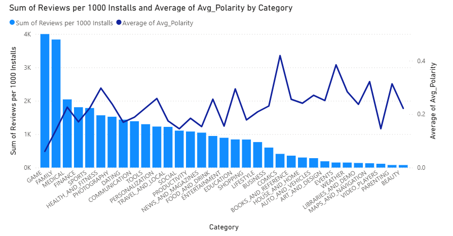
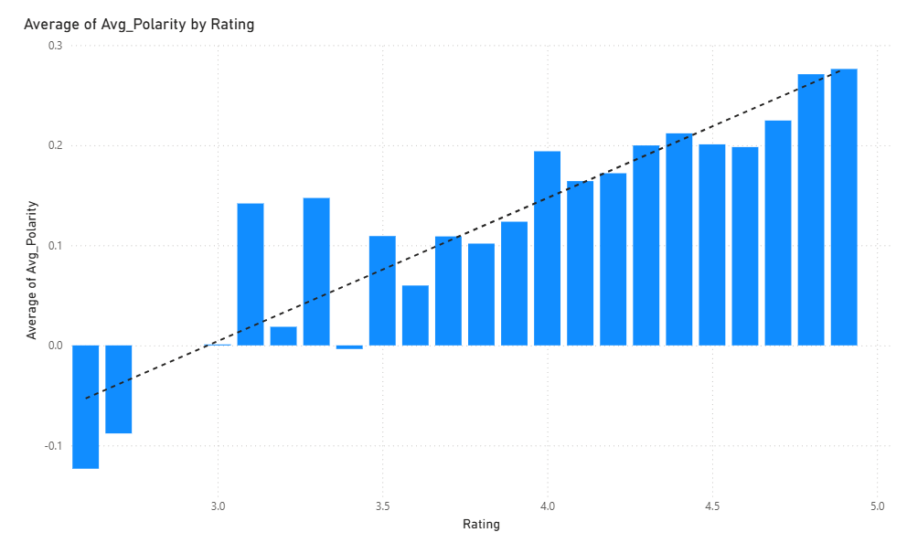
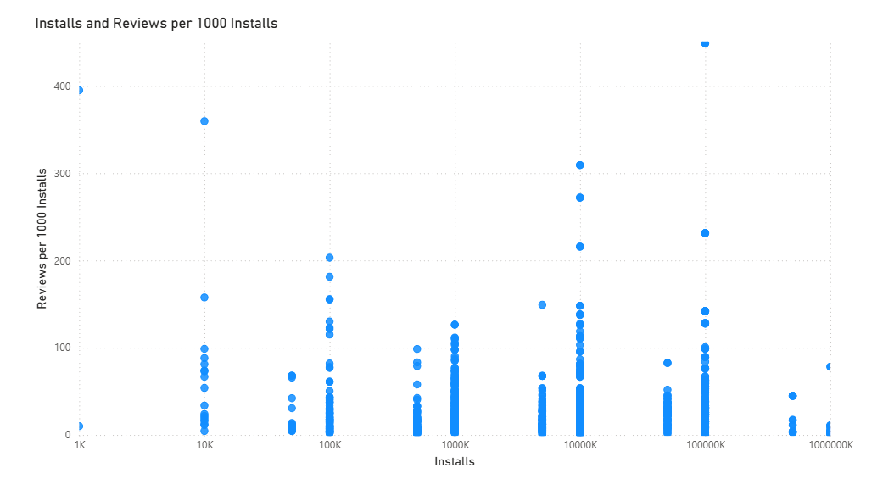

# Google Play Store Analysis

This project conducts an in-depth exploratory analysis of the Google Play Store dataset, which contains data on over 10,000 mobile applications. The goal was to uncover trends in app categories, pricing strategies, and user satisfaction.

To achieve this, the project involved a comprehensive data cleaning and preparation pipeline, followed by advanced analysis, including Natural Language Processing (NLP) for sentiment analysis of user reviews. All findings are presented in an interactive, multi-page Power BI dashboard designed to provide clear, actionable insights.

---

## Key Insights from the Dashboard

The dashboard is structured to tell a story about the app market, from a high-level overview to a deep dive into user sentiment and engagement.

### 1. Category Analysis: Market Saturation & User Sentiment



**Findings:** 
- **Market Saturation:** The **Family** and **Game** categories dominate the marketplace with the highest number of apps, indicating intense competition. Categories like **Events** and **Beauty** show significantly lower saturation, potentially representing untapped opportunities.
- **User Sentiment:** Categories like **Health & Fitness** and **Books & Reference** demonstrate consistently high sentiment scores, indicating strong user satisfaction. Categories with lower sentiment scores highlight potential gaps where improved apps could succeed.

---

### 2. Sentiment vs. Rating Correlation



**Finding:** A striking discovery shows only a **weak positive correlation (0.22)** between star ratings and review sentiment. This misalignment reveals that high-rated apps don't necessarily have positive user reviews, suggesting that star ratings alone may not tell the complete story of user satisfaction.

---

### 3. User Engagement vs App Popularity



**Finding:** The analysis revealed a sharp downward trend, which we termed **"engagement dilution."** As apps gain massive popularity (moving from 10,000 to 10 million installs), the rate at which an individual user writes a review drops significantly. This demonstrates that while popular apps have more reviews in total, their average user is far less engaged in providing feedback.

---

## Data Preprocessing Pipeline

### 1. Play Store Data (`pre_playstore.ipynb`)
```
Input: dataset/PlayStoreData.csv (10,841 apps × 13 features)
```
1. **Data Cleaning**
   - Converted ratings to numeric, imputed missing values with median (1,474 missing)
   - Cleaned install counts: removed '+,', converted to numeric
   - Standardized app sizes (KB/MB/GB to bytes)
   - Handled missing values in Content Rating, Current Ver, Android Ver

2. **Feature Engineering**
   - Computed category-wise rating medians
   - Created install count bands for analysis
   - Normalized price data

```
Output: processed/PlayStoreData_CLEAN.csv
```

### 2. User Reviews (`pre_userreview.ipynb`)
```
Input: dataset/UserReview.csv
```
1. **Sentiment Processing**
   - Dropped rows with missing sentiment scores
   - Converted sentiment polarity & subjectivity to float
   - Aggregated by app:
     - Average sentiment polarity
     - Average subjectivity
     - Review count

```
Output: processed/UserReview_Aggregated.csv
```

### 3. Data Integration (`pre_merge.ipynb`)
1. **Merge Operation**
   - Combined clean Play Store data with aggregated reviews
   - Computed correlation between ratings & sentiment (0.22)
   - Generated final analysis-ready dataset

```
Output: processed/Merged_PlayStore_Reviews.csv
```

---

